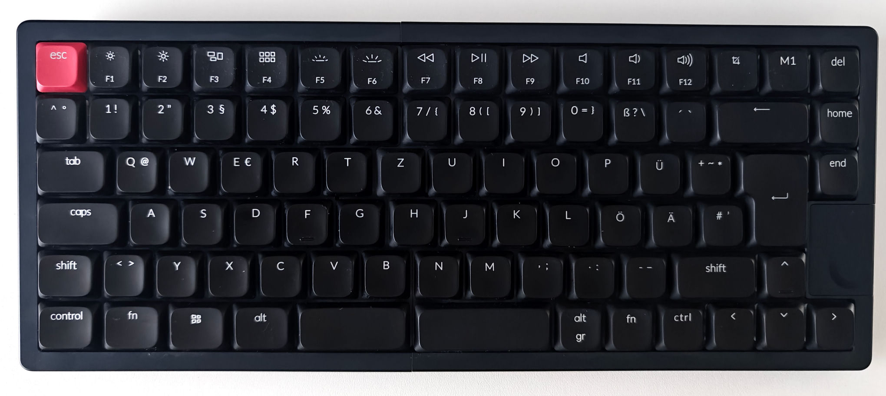

# NocFree& ISO firmware (`iso-de` branch)

A community ZMK build for the **ISO** NocFree &, forked from
[NocFreeKB/NocFree-and-zmk](https://github.com/NocFreeKB/NocFree-and-zmk).
Upstream ports the ANSI board; this branch adds the 85-key ISO matrix, the
backlight and a bootloader key on each half.

Shared as-is for reference by [@thie1e](https://github.com/thie1e).

## TL;DR

**This is not official NocFree firmware. Use at your own risk.**

**Full disclaimer: I have been using the firmware for a few 
weeks with practically no lost keystrokes (unless the distance 
between the halves is very large)! It is completely vibe-coded, 
though. Read the sections about what works and what doesn't work.**

**The layout and the function keys are my personal preference, see
below. Adjust that to your liking.** 

**Note that the keyboard does not go to sleep anymore using this 
firmware! I like it better this way, as I use it in dual wired mode
only, but keep that in mind.**

**Backlight works, but it was tricky to get both halves to the same
brightness. I am using fixed brightness values for that reason, 
so using this firmware you can only switch the backlight on or off 
using F5 and F6, there are no brightness levels anymore.**

**Ready-built images are attached to the
[latest release](https://github.com/Thie1e/NocFree-and-zmk/releases/latest),
so you do not have to build anything.** To flash a half, hold `Fn`+`Esc`
(left) or `Fn`+`Delete` (right) for 1.5 s: it reboots into its bootloader and
appears as a USB drive you copy the `.uf2` onto. **The right half needs its
own USB cable for that drive to appear.** Coming from factory firmware, which
has no `Fn`+`Esc`, hold `Fn`+`5`. Details and the way back in
[docs/recovery.md](docs/recovery.md).

The disclaimer in section 1 of the porting guide
below applies in full, including the part about permanently damaging your
hardware.

> **I only use ISO DE, but the firmware should work for other locales, too.** 
> HID keycodes are positional: the firmware
> sends *which key was pressed*, and your operating system decides what it
> prints. This branch adds the two keys ISO has and ANSI does not, so it serves
> German, French, Spanish, Nordic and every other ISO layout equally. Set the
> layout in your OS. See [docs/iso-de.md](docs/iso-de.md).

## What works

Everything here works on my ISO unit unless noted otherwise — on Linux, in
daily use since 2026-08-22.

| Feature | Notes |
|---|---|
| **ISO layout, 85 keys** | 38 left / 47 right. Adds `NON_US_BSLH` (`<>\|`) and `NON_US_HASH` (`#'`). Keycaps read out of the factory ISO image, not guessed. |
| **USB** | Left half is the split central and talks to the host. This is how I use it. |
| **Bluetooth — built but untested by me** | Five BLE profiles are bound on the `Fn` layer and the code is ZMK's stock BLE, untouched by this fork. I run the keyboard wired and cannot vouch for it. |
| **Backlight** | Works. On `P0.20`, one PWM channel. Absolute levels only — see the drift note below. |
| **Per-half brightness correction** | The halves differ at the same duty. A small module-local LED driver (`nocfree,scaled-led`) scales each half by a fixed percentage. Otherwise I could not get the halves to the same brightness. So there is only one fixed brightness level (on/off), because synchronizing the backlight between left and right is tricky. Which is maybe also the reason why that didn't work well out-of-the-box. Also, the brightness depends on whether USB is connected and for the right half additionally on switching it on or off. |
| **Bootloader from the keymap** | `Fn`+`Esc` (left) and `Fn`+`Delete` (right), held 1.5 s. To flash the right half, both have to be connected via USB, because keystrokes are transmitted via the left. |
| **Media and navigation keys** | Volume, transport, `Home`/`End`, `PgUp`/`PgDn`, real `F5`–`F12` on the `Fn` layer. |
| **< key** | With the stock firmware, < and > were transmitted only after releasing that key, for whatever reason, but ZMK resolved that. |

**The keymap is my favorite arrangement, not the factory layout.** Bottom rows,
the navigation cluster and the function row were rearranged to taste. Read
[`nocfree_and.keymap`](boards/nocfree/nocfree_and/nocfree_and.keymap) before
flashing and change it to your preference.



The symbols on `F1`-`F4` are macOS functions the factory firmware sent; this build
sends the plain function keys instead. What the top row actually does:

| Key | On its own | With `Fn` |
|---|---|---|
| `F1`-`F4` | `F1`-`F4` | same |
| `F5` / `F6` | backlight **off** / **on** | `F5` / `F6` |
| `F7`-`F12` | prev, play/pause, next, mute, volume down, volume up | `F7`-`F12` |
| the key left of `M1` | `PrtSc` | — |
| `M1` | nothing — unbound | — |

Only `F5`-`F12` are remapped, and `Fn` gives you the real function key back.
`F1`-`F4` need no such escape because they are already the real ones. 

The rest of the `Fn` layer:

| `Fn` + | Does |
|---|---|
| `Esc` | tap: reset the left half. Hold 1.5 s: left bootloader. |
| `Del` | the same for the right half (that half needs its own USB cable) |
| `1`-`5` | select Bluetooth profile 1-5 |
| `0` | clear the current Bluetooth profile |
| `u` / `b` | output to USB / Bluetooth |
| `i` | type the battery level — but see the stub warning below |
| `Home` / `End` | Page Up / Page Down |

Everything not listed passes through unchanged.

## What does not work

| Not implemented | Why |
|---|---|
| A trustworthy battery level | There is a readout on `Fn`+`i`, but it is a stub — see below. The right half has none at all. |
| Numpad | Separate device, I don't own one. |
| Factory USB receiver / 2.4 GHz dongle | Proprietary encrypted ESB protocol. ZMK speaks BLE; the factory dongle will never work with this firmware. |
| Deep sleep / soft off | Not implemented, and this build **never powers down**. See the power note below. |
| Status LEDs, charge indicator, mode switch | Unverified output pins and polarity. Left alone rather than configured with a guess. |
| ZMK Studio | Needs per-key physical geometry this port has not measured. |

Rough edges worth knowing before you flash:

- **Power.** With no deep sleep and a 60-minute idle timeout, this firmware
  drains the battery faster than the factory one. That was a deliberate choice
  for a keyboard that lives on a cable. I like it better this way, because 
  otherwise I always had to wake up both halves after a short time and I could
  never tell if the keyboard had gone to sleep or not. If you run yours on battery,
  set `CONFIG_ZMK_IDLE_TIMEOUT` back down and consider implementing sleep.
- **Flash headroom is nearly gone on the left.** About 95 % of the 248 KiB code
  partition. Small keymap changes fit; a large feature does not.
- **Split reliability** uses ZMK's stock protocol, tuned for link margin. A
  dropped notification is repaired by the next key event, not immediately.
- **Backlight brightness drifts apart between the halves** unless you use
  absolute levels. This is a ZMK-wide issue, not specific to this board: the
  behaviour is global but there is no state sync, so one missed relay puts a
  permanent offset between the halves and relative steps preserve it. That is
  why this keymap binds `&bl BL_SET 100` and never `BL_INC`/`BL_DEC`.
- **The battery readout is a stub. Do not trust it.** `Fn`+`i` types `bat NN`
  on the left half, and on the unit it was written for it reads `100`
  permanently. The measurement path itself works (ADC, divider enable, 
  the typed output); only the number is wrong. Treat it as a worked example
  of a typed readout, not as a fuel gauge.
- **The brightness figures are one unit's.** Tuned by eye; expect to change them.

## Building it yourself

```sh
./scripts/build-local.sh /tmp/nocfree-build   # needs Docker, ~3.1 GB
./tests/run.sh                                # no hardware needed
```

Then read, in this order:

| Document | Contents |
|---|---|
| [docs/recovery.md](docs/recovery.md) | **Read this first.** How to reach the bootloader and how to get back to factory firmware. |
| [docs/iso-de.md](docs/iso-de.md) | What ISO changes, and why this is not a German keymap |
| [docs/backlight.md](docs/backlight.md) | The scaled-LED driver, the PWM rate, and the coil whine |
| [docs/battery.md](docs/battery.md) | The divider, why the number is wrong, and the typed readout |
| [docs/limitations.md](docs/limitations.md) | The full list of what is excluded and unverified |
| [docs/build.md](docs/build.md), [docs/testing.md](docs/testing.md) | Building, and what the tests do and do not cover |
| [docs/architecture.md](docs/architecture.md) | Roles, key scanning, flash layout (upstream) |

**Flashing needs the right half cabled too.** Both halves have their own USB-C
port. `Fn`+`Delete` resets the right half into its bootloader, but the drive
only appears if that half is plugged into the host itself — a USB device needs
a host to enumerate to. Left cable alone is not enough.

## Licence and attribution

MIT, unchanged from upstream. The porting guide below is **NocFree's own
document** and is reproduced intact; the hardware facts in it are theirs, and
this fork's tests assert that its sections stay unmodified.

Everything from here down are upstream's docs.

---

# NocFree Keyboard ZMK Porting Guide

This document is intended for community members developing ZMK support for NocFree nRF52833 split keyboards. It provides the hardware interfaces and porting information required for community development. ZMK-related code is implemented and maintained by the community; NocFree does not provide official ZMK firmware or guarantee compatibility.

Publishing hardware compatibility information on this page does not make the NocFree keyboard hardware open source. Keyboard schematics, PCB designs, mechanical designs, manufacturing materials, and factory firmware are not open-source parts of this project.

## 1. Disclaimer and No-Warranty Notice

Flashing third-party or self-compiled open-source firmware is an unofficial modification performed at the user's own discretion. It may prevent the device from booting, cause key or wireless functions to fail, erase configuration or pairing data, increase power consumption, or permanently damage the hardware.

Before proceeding, make sure you understand and accept the following:

- Back up the factory firmware, configuration, and pairing data, and prepare a working recovery method.
- Incorrect firmware, devicetree, pin, power-control, or bootloader configuration may render the device unusable.
- After flashing open-source firmware, the factory update tool, web configurator, 2.4 GHz receiver, and other companion features may no longer be compatible.
- The operator assumes all responsibility for device failure, data loss, personal injury, or property damage caused by flashing, modifying, or using unofficial firmware.
- No express or implied warranty is provided for the condition, functionality, stability, compatibility, or recoverability of hardware or software after flashing open-source firmware. No warranty service, returns, replacements, or free technical support are provided.
- Where local law grants mandatory consumer rights, those rights take precedence.

**By proceeding, you acknowledge these risks and accept full responsibility.**

## 2. Project Links

- GitHub repository: <https://github.com/NocFreeKB/NocFree-and-zmk>
- ZMK documentation: <https://zmk.dev/docs>

## 3. Hardware Architecture

The keyboard uses a split design. The current factory firmware implements the following wireless links:

```text
Right nRF52833 internal RADIO ── ESB ──┐
                                       ├── Left external nRF24L01 ── Left controller
Numpad nRF52833 internal RADIO ── ESB ─┘                │
                                                        ├── USB HID ── Computer
                                                        ├── BLE HID ── Computer / mobile device
                                                        └── Left nRF52833 internal RADIO
                                                                │
                                                                └── ESB ── USB receiver
```

In the current code, the external nRF24L01 on the left half connects to the controller over SPI. It primarily receives key data from the right half and numpad and sends backlight control data back to them. The right half and numpad do not drive an external nRF24L01 over SPI; they use their own nRF52833 internal RADIO peripherals and an ESB protocol configured with nRF24-compatible on-air parameters.

When sending HID reports to the USB receiver, the current code uses the left nRF52833 internal RADIO on a channel separated from the split-keyboard link. The external nRF24L01 on the left half therefore should not be described as the USB receiver communication radio.

For a ZMK port, the recommended approach is to replace the factory ESB split link with standard ZMK BLE split communication. Retaining the factory right-half ESB link or USB receiver requires separate ports of the relevant drivers, pairing data, and proprietary protocol; standard ZMK configuration alone is not sufficient.

The keys are not wired directly as row and column GPIOs on the nRF52833. Each half uses multiple PCA9555 devices over I²C as key inputs. The PCA9555 `INT` signal connects to the controller and wakes it when a key state changes. Standard layouts read 6 rows × 8 bits on each half; the KR layout reads one additional row. Unpopulated matrix positions should be ignored by the ZMK transform or key-position mapping.

## 4. Pins Required for ZMK Porting

> `D0` through `D16` in the following tables are logical aliases from this project's Arduino board package. ZMK/Zephyr devicetrees must use the corresponding nRF GPIOs. The left and right aliases use different mappings and are not interchangeable.

### 4.1 Left Controller

| Function | Arduino alias | nRF52833 GPIO | ZMK porting notes |
|---|---:|---:|---|
| PCA9555 interrupt | D1 | P0.31 | Active low; input pull-up; may be used as a wake source |
| I²C SDA | D6 | P0.11 | PCA9555 bus; factory firmware uses 400 kHz |
| I²C SCL | D7 | P1.09 | PCA9555 bus; factory firmware uses 400 kHz |
| BLE position detect | D2 | P0.15 | Input pull-up; low when the switch is in the BLE position; optional in ZMK |
| 2.4 GHz position detect | D3 | P0.17 | Input pull-up; low when the switch is in the 2.4 GHz position; optional in ZMK |
| Red charge/low-battery indicator | D4 | P0.09 | Shared with charge status; factory firmware emulates open-drain control and releases the pin while USB-powered |
| Keyboard backlight | D5 | P0.20 | PWM/GPIO output; the current brightness API drives the pin low at endpoint value `255`; verify the physical on/off polarity after porting |
| Blue status LED | D0 | P0.10 | Direct GPIO control; board definition uses active low |
| Battery ADC | D15 | P0.04 | Reads the battery divider |
| Battery-divider enable | D16 | P0.05 | High enables the divider; disable it after sampling to reduce power consumption |

### 4.2 Right Controller

| Function | Arduino alias | nRF52833 GPIO | ZMK porting notes |
|---|---:|---:|---|
| PCA9555 interrupt | D0 | P0.05 | Active low; input pull-up; may be used as a wake source |
| I²C SDA | D6 | P0.11 | PCA9555 bus |
| I²C SCL | D7 | P1.09 | PCA9555 bus |
| Red charge/low-battery indicator | D4 | P0.17 | Shared with charge status; factory firmware emulates open-drain control and releases the pin while USB-powered |
| Keyboard backlight | D5 | P0.20 | PWM/GPIO output; the current brightness API drives the pin low at endpoint value `255`; verify the physical on/off polarity after porting |
| Battery ADC | D15 | P0.04 | Reads the battery divider |
| Battery-divider enable | D16 | P0.31 | High enables the divider; disable it after sampling to reduce power consumption |

### 4.3 PCA9555 Key Inputs

| Item | Configuration |
|---|---|
| I²C addresses | `0x20`, `0x22`, `0x24` |
| Standard-layout port order | `0x20/P0`, `0x20/P1`, `0x22/P0`, `0x22/P1`, `0x24/P0`, `0x24/P1` |
| Additional KR-layout port | `0x21/P0` |
| Port direction | Input |
| Factory-firmware polarity | PCA9555 input polarity inversion registers set to `0xFF` |
| Valid bits per port | Normally 8 bits; unpopulated key positions are ignored by the mapping layer |

The ZMK port must enable Zephyr I²C and GPIO-expander support and define PCA9555 devicetree nodes. The exact scanning implementation depends on the bindings and driver capabilities provided by the selected ZMK/Zephyr version. If that version cannot use GPIO-expander pins directly for keyboard scanning, a minimal scanning driver will be required.

### 4.4 Left External nRF24L01 Interface (Optional)

In the current code, these SPI signals are used only by the left external nRF24L01 data path for communication with the right half and numpad. They are not required when using standard ZMK BLE split communication. The factory right-half ESB link uses the nRF52833 internal RADIO and does not use these SPI pins.

| nRF24L01 signal | Left Arduino alias | Left nRF52833 GPIO |
|---|---:|---:|
| SCK | D8 | P0.28 |
| MOSI | D9 | P0.29 |
| MISO | D10 | P0.30 |
| CE | D11 | P0.03 |
| CSN | D12 | P0.02 |

## 5. Battery Measurement Parameters

The current firmware uses a 12-bit ADC. It drives the divider-enable pin high before sampling and converts the measured voltage to battery voltage using a `130/100` scale factor. The port should preserve the enable-on-demand and disable-after-sampling behavior to avoid continuous divider current.

These values come from the current firmware and do not replace a complete schematic. Calibrate the ADC reference voltage, divider ratio, battery curve, charge-state detection, and low-voltage threshold against the target hardware revision.

## 6. Recommended Porting Order

1. Create separate nRF52833 board/shield configurations for the left and right halves. Verify USB, serial, and the firmware recovery path first.
2. Enable I²C, confirm that every PCA9555 address can be detected, then verify the interrupt pins and all key inputs.
3. Configure ZMK split with the left half as central and the right half as peripheral. Complete BLE split input first; a standard ZMK port does not require the external nRF24L01 on the left half.
4. Add battery measurement, status indicators, and backlighting. Calibrate active levels, PWM polarity, and the battery curve on real hardware.
5. Evaluate optional compatibility features such as the mode switch and factory 2.4 GHz receiver last.

## 7. Pre-Flash Checklist

- Verify the device hardware revision, keyboard half, and layout.
- Make sure the ZMK devicetree uses nRF GPIO numbers rather than copying Arduino `D` aliases directly.
- Keep a recoverable bootloader and prepare a known-working recovery firmware image before testing.
- Disable the backlight and optional peripherals during initial testing, then verify idle current, battery measurement, and deep sleep.
- Before connecting the battery, check GPIO levels, power-control signals, and the charging circuit to prevent output contention or a continuously enabled divider.

> The pin mappings in this document were derived from the current Arduino firmware and custom board definitions in this repository. Before releasing ZMK firmware, verify them against the schematic for the relevant hardware revision and confirm them on real hardware with a multimeter or logic analyzer.

## 8. License and Scope

Community-developed ZMK support code and its accompanying documentation are licensed under the [MIT License](https://opensource.org/license/mit). This license applies only to content explicitly identified as community ZMK support. It does not apply to NocFree keyboard hardware, schematics, PCB designs, mechanical designs, manufacturing materials, trademarks, bootloaders, or factory firmware.

Contributors must submit only content they have the right to release under the MIT License. Third-party projects and included third-party content remain subject to their original licenses.

## 9. Community ZMK Module in This Repository

This repository also contains a community ZMK keyboard module, `zmk-keyboard-nocfree-and`, providing a minimum ANSI left/right port built on the interfaces documented above. The left half is the ZMK split central and presents Bluetooth or USB HID to the computer; the right half is a Bluetooth split peripheral. It is community work covered by section 8, not official NocFree firmware, and the disclaimer in section 1 applies in full.

Numpad, factory USB receiver, 2.4 GHz, battery reporting, backlighting, and indicators are deliberately not included.

| Document | Contents |
|---|---|
| [docs/build.md](docs/build.md) | Building both images from pinned public dependencies |
| [docs/architecture.md](docs/architecture.md) | Roles, key scanning, flash layout, and the engineering decisions behind them |
| [docs/recovery.md](docs/recovery.md) | Bootloader preservation, recovery paths, and stop conditions |
| [docs/limitations.md](docs/limitations.md) | What is excluded, known rough edges, and claims not made |
| [docs/testing.md](docs/testing.md) | Automated checks and the physical verification a build still needs |
